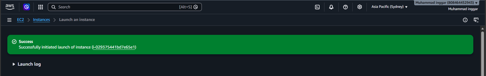
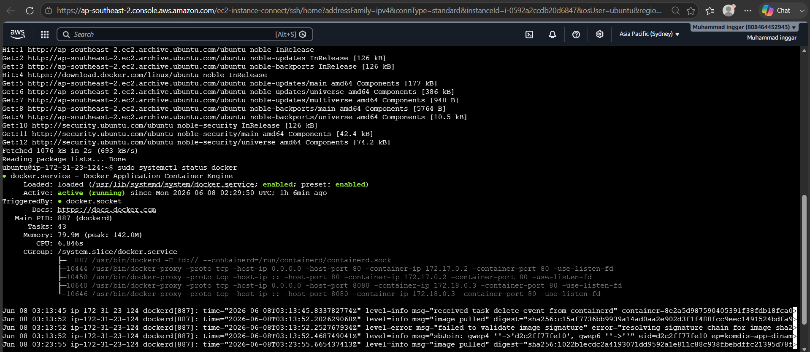
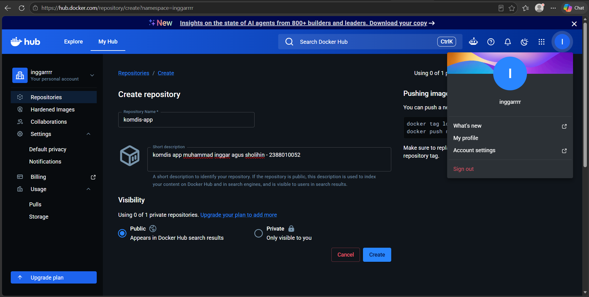
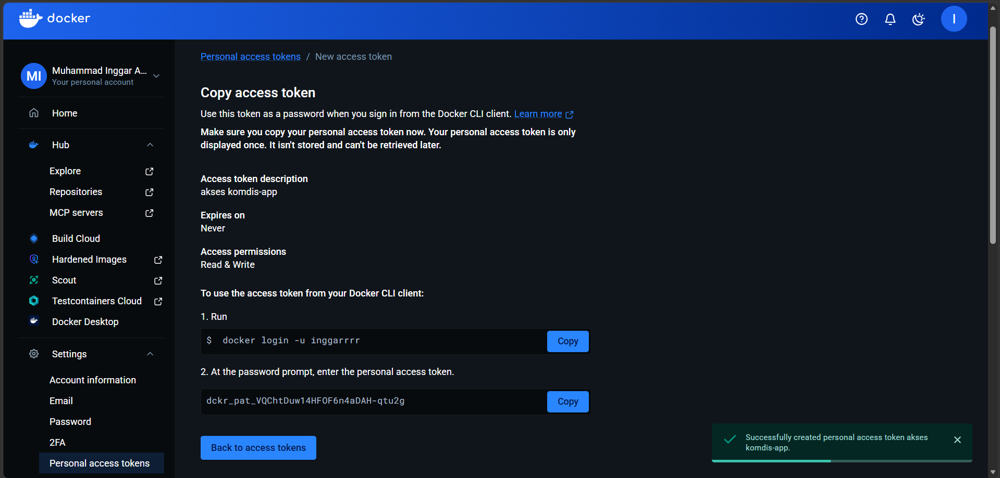
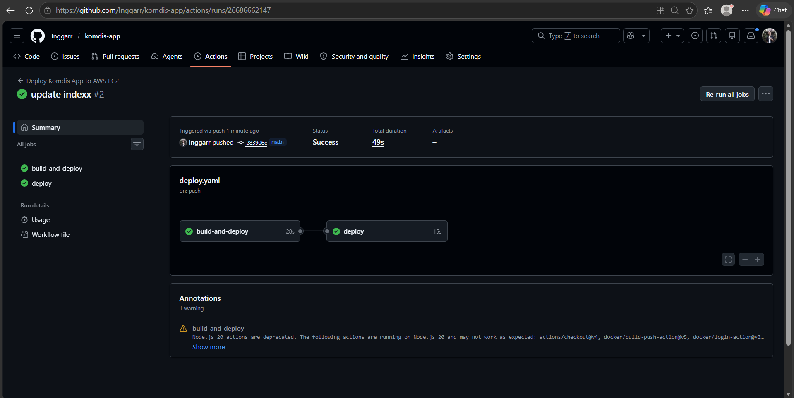
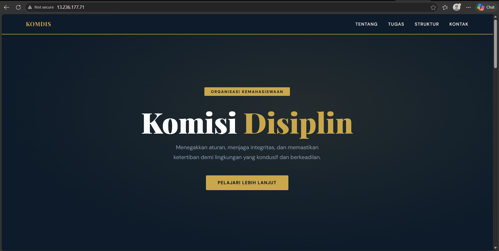
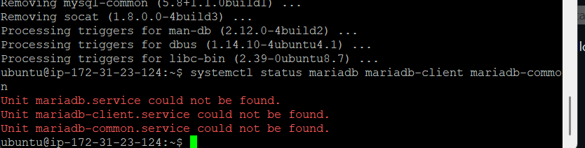
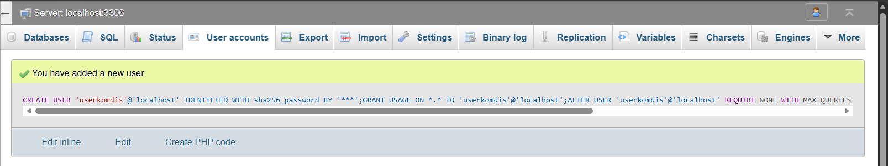
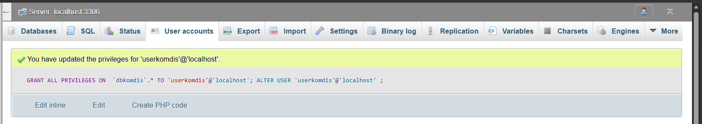

## DOKUMENTASI UAS MMUHAMMAD INGGAR A S (2388010052) - INFORMATIKA 6B

membuat instance baru 

1. instaall docker di ssh
   - !

2. buka https//docker.com
   - buat repositori baru 
   - Create Token Access  
   - Buat repositori github 

=======================================================================================================

3. Moderenisasi CI/CD
   - Mengisi Secrets Variable di Github Actions 
   - build and deploy  
   - cek web 

=======================================================================================================

4. Deploy Multi Apps CI/CD Docker
   - uninstall apache dan mariadb
   
   - Create user baru bukan root di BMS (Laragon) 
   - edit privilages 
   
5. Docker compose
   - repo docker baru 
   - bikin repo github baru
   - deploy 

struktur folder
